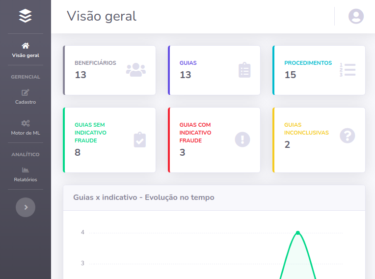
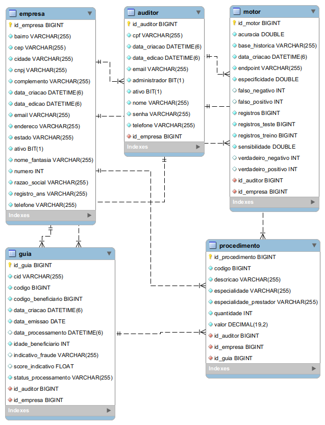

# Audit<sup>+</sup>
Sistema para auditoria de guias médicas


## Visão geral do sistema



## Diagrama entidade relacionamento



## Como executar?

### Configurar variáveis de ambiente
- MySQL
    - MYSQL_HOST
    - MYSQL_PORT
    - MYSQL_SCHEMA
    - MYSQL_USUARIO
    - MYSQL_SENHA
- AWS
    - AWS_ACCESS_KEY_ID
    - AWS_SECRET_ACCESS_KEY
    - AWS_REGION
- AWS S3
    - AWS_S3_BUCKET
    - AWS_S3_BASE_HISTORICA
    - AWS_S3_BASE_TREINAMENTO
- AWS SageMaker
    - AWS_SAGEMAKER_ROLE_ARN
    - AWS_SAGEMAKER_IMAGEM
    - AWS_SAGEMAKER_NAMESPACE
    
### Iniciar aplicação
```mvn spring-boot:run```

## Como consumir a aplicação?
- WEB
    - http://localhost:8080
- REST
    - Empresa
        - GET e PATCH
            - /rest/{cnpj}/empresa
    - Auditor
        - GET e POST 
            - /rest/{cnpj}/auditores
            - /rest/{cnpj}/auditores/{cpf}
        - PATCH e DELETE
            - /rest/{cnpj}/auditores/{cpf}
    - Guia
        - GET e POST 
            - /rest/{cnpj}/guias
            - /rest/{cnpj}/guias/{codigo}
        - PATCH e DELETE
            - /rest/{cnpj}/guias/{codigo}
    - Motor
        - GET e POST 
            - /rest/{cnpj}/motores
            - /rest/{cnpj}/motores/treinamento
    - Relatorio
        - GET
            - /rest/{cnpj}/relatorios/geral
            - /rest/{cnpj}/relatorios/idade
            - /rest/{cnpj}/relatorios/especialidade
            - /rest/{cnpj}/relatorios/prestador
            - /rest/{cnpj}/relatorios/tempo
